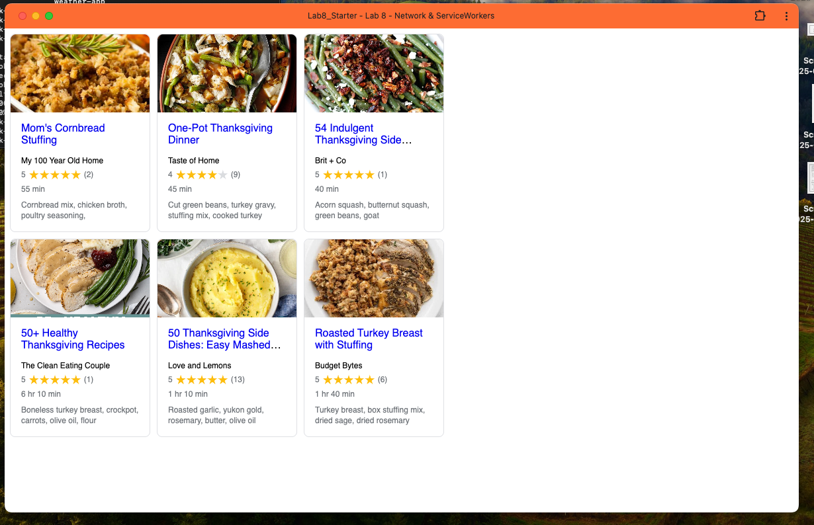

# Lab8-Starter

[url](https://ryansoe.github.io/Lab8_Starter/)

Graceful degradation and service workers are closely related because service workers exemplify how modern web applications can provide enhanced experiences while maintaining functionality across different browser capabilities. In our recipe application, service workers enable advanced PWA features like offline functionality, background caching, and fast loading through cache-first strategies. However, the application gracefully degrades when service workers aren't supported or fail to register - the core functionality of fetching and displaying recipes still works through direct network requests, just without the performance and offline benefits. This demonstrates graceful degradation in action: we start with the full-featured PWA experience (maximum technology) and gracefully fall back to a standard web application when advanced features aren't available, ensuring all users can access the content regardless of their browser's capabilities.

